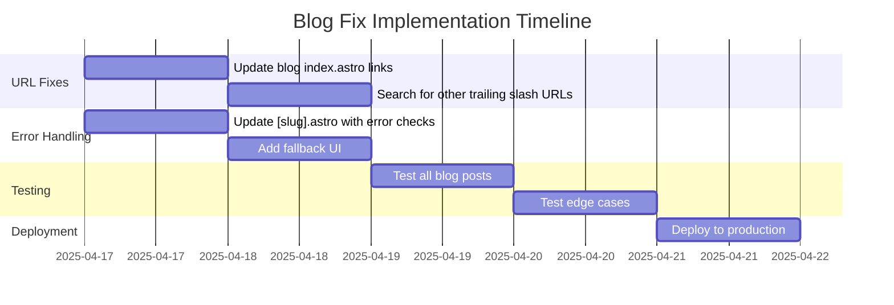
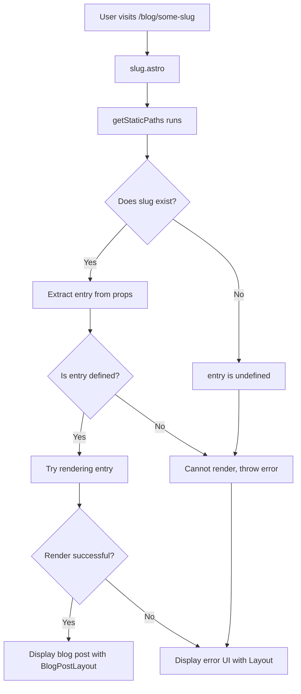

# Blog Fix Visual Explanation

## Current Issue Diagram

```mermaid
flowchart TD
    A[User] -->|1. Clicks blog link| B[Blog Index]
    B -->|2. Link generated with trailing slash: \n/blog/a-new-web-standard/| C[404 Error]
    C -->|3. Error message suggests: \n"Do you want to go to /blog/a-new-web-standard instead?"| D[Correct URL]

    A -->|4. Directly visits \n/blog/a-new-web-standard| E[slug.astro]
    E -->|5. TypeError: Cannot read properties \nof undefined 'render'| F[Server Error]

    subgraph "Configuration"
    G[astro.config.mjs:\ntrailingSlash: 'never']
    end

    subgraph "Conflicting Code"
    H[blog/index.astro:\nhref={`/blog/${post.slug}/`}]
    end

    G -.->|Conflict!| H
```

## Solution Architecture

```mermaid
flowchart TD
    A[User] -->|1. Clicks blog link| B[Blog Index]
    B -->|2. Link generated WITHOUT trailing slash: \n/blog/a-new-web-standard| E[slug.astro]

    E -->|3. Check if entry exists| F{Entry Found?}
    F -->|Yes| G[Render Blog Post]
    F -->|No| H[Show Friendly Error Page]

    subgraph "Fixed Configuration"
    I[astro.config.mjs:\ntrailingSlash: 'never']
    end

    subgraph "Fixed Code"
    J[blog/index.astro:\nhref={`/blog/${post.slug}`}]
    K[slug.astro:\nError handling added]
    end

    I -.->|Consistent!| J
    K -.->|Prevents errors| F
```

## Implementation Steps



## Error Handling Flow



This visual representation shows:

1. Where the conflict exists in the current implementation
2. How the fix addresses both the URL format consistency and error handling
3. The logical flow of how errors will be handled after the fixes
